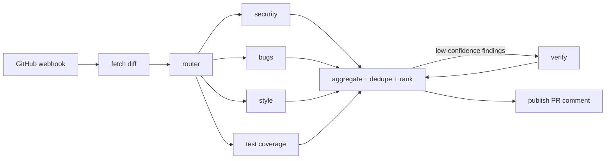

# AI Pull Request Review Agent

A GitHub bot that reviews pull requests with a **LangGraph** multi-agent workflow and ships through a
**CI/CD pipeline that gates deployment on LLM evaluation results**.



## Features
- Parallel reviewer nodes with structured (Pydantic) output
- Confidence scoring + verification loop to cut false positives
- HMAC-verified GitHub webhooks (FastAPI)
- Offline heuristic mode so tests and CI run without API keys
- **Eval gate**: `python -m evals.run_eval` fails the build if recall/precision drop
- Docker image to GHCR, auto-deploy to Cloud Run, LangSmith tracing (optional)

## Run locally
```bash
python -m venv .venv && source .venv/bin/activate
pip install -r requirements-dev.txt
cp .env.example .env            # add ANTHROPIC_API_KEY or OPENAI_API_KEY
pytest -q
python -m evals.run_eval
uvicorn app.main:app --reload
```
Try it on a diff without GitHub:
```python
from app.graph import run_review
print(run_review(diff=open("sample.diff").read())["comment"])
```

## Hook up GitHub
1. Create a webhook on your repo → `https://<your-url>/webhook`, content type JSON, event: Pull requests.
2. Set `GITHUB_WEBHOOK_SECRET`, `GITHUB_TOKEN` (PR read + write), and `DRY_RUN=0`.
3. Expose locally with ngrok while developing.

## CI/CD secrets (GitHub → Settings → Secrets)
`ANTHROPIC_API_KEY`, `GCP_SA_KEY`. Create a `production` environment for approvals.

## Roadmap
- Inline review comments on exact diff lines (Pull Request Review API)
- RAG over your team's coding guidelines (Chroma)
- LangGraph checkpointing + Postgres, Langfuse cost dashboards
